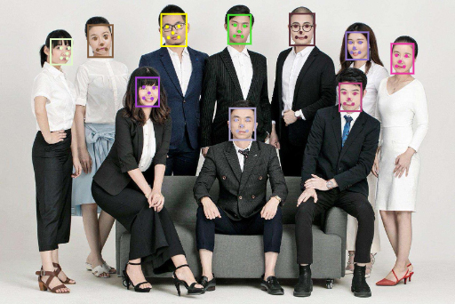

# Retinaface-WASM [](https://www.npmjs.com/package/retinaface-wasm) [](LICENSE)

This is a WASM implementation of the Retinaface face detection algorithm. It is based on the [Retinaface](https://arxiv.org/abs/1905.00641) paper.

> 本模块支持微信小程序且不依赖任何第三方库, 可直接使用! (手动 brotli 压缩 wasm 文件和拷贝 index.ts 代码即可)

## Screenshots



## Usage

### Installation

```bash
npm install retinaface-wasm
```

### Example

```typescript
import Retinaface, { getWasmFile, env } from 'retinaface-wasm'
import imagePath from './R.jpg'

const wasm = await WebAssembly.instantiateStreaming(fetch('https://cdn.jsdelivr.net/npm/onnxruntime-wasm/dist/wasm/' + getWasmFile()), env)
const retinaface = new Retinaface(wasm.instance)

const image = new Image()
image.src = imagePath
await new Promise((resolve, reject) => {
  image.onload = resolve
  image.onerror = reject
})

const [data, scale] = retinaface.processImage(image)
const result = retinaface.detect(data, scale)

console.log(result)

retinaface.close()
```

## Brotli Compress WASM 

```bash
node -e "fs.writeFileSync('retinaface-basic.wasm.br', zlib.brotliCompressSync(fs.readFileSync('retinaface-basic.wasm')))"
```

## Examples

[Examples](examples)

## Author

Shirasawa

## License

[MIT](LICENSE)
